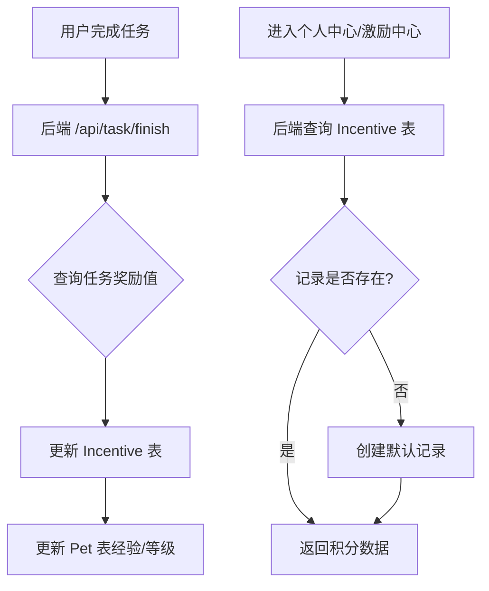

# 修复积分持久化及显示问题方案

## 问题分析
1.  **积分未持久化/获取失败**：
    *   后端 `backend/routes/user_center.js` 在获取 `dashboard` 数据时，如果 `Incentive` 表中没有对应宠物的记录，直接返回 0，且未进行初始化。
    *   后端 `backend/routes/task.js` 在任务完成时，积分奖励逻辑使用了硬编码的基数（10分），而非任务定义的奖励值。
    *   后端 `backend/routes/incentive.js` 的 `core` 接口虽然会初始化数据，但如果用户先访问个人中心再访问激励中心，可能会看到不一致的数据。

2.  **积分显示为 0 或重置为 120**：
    *   用户提到“重新打开任务界面还是会重置为 120 积分”，需要排查前端是否有硬编码的初始值或 Mock 数据干扰。
    *   激励界面显示 0 积分是因为后端返回的数据确实为 0，或者前端未正确刷新。

## 修复步骤

### 1. 后端修复 (Node.js/Sequelize)
- [ ] **修改 `backend/routes/user_center.js`**：
    - 在 `dashboard` 路由中，如果找不到当前宠物的 `Incentive` 记录，应立即创建一个默认记录（积分设为 0 或初始值），确保数据一致性。
- [ ] **修改 `backend/routes/task.js`**：
    - 在 `finish` 路由中，将积分奖励逻辑改为使用 `task.benefit_value`。
    - 确保积分累加逻辑正确更新 `integral` 和 `integralGet` 字段。
- [ ] **统一初始化逻辑**：
    - 建议在宠物创建时（`backend/routes/pet.js`）就同步创建 `Incentive` 记录。

### 2. 前端修复 (Flutter)
- [ ] **排查“120积分”来源**：
    - 检查 `lib/providers/app_state_provider.dart` 或其他全局状态管理类，看是否有硬编码的 120 初始值。
    - 检查 `lib/screens/task_center_page.dart` 的 `initState` 逻辑。
- [ ] **优化数据刷新**：
    - 确保任务完成后，前端能正确触发全局状态更新或重新拉取最新积分。

### 3. 验证
- [ ] 完成任务后检查数据库 `incentive` 表。
- [ ] 切换页面（任务中心 <-> 激励中心）检查积分是否同步。
- [ ] 重启应用检查积分是否持久化。

## 数据库联动逻辑说明 (Mermaid)

